```{r setup, include = FALSE}
library(knitr)
library(tidyverse)
library(xaringanExtra)
xaringanExtra::use_panelset()
# set default options
opts_chunk$set(dpi = 300,
               echo = FALSE)
```

class: title-slide, left, bottom

# `r rmarkdown::metadata$title`
----
## **`r rmarkdown::metadata$subtitle`**
### `r rmarkdown::metadata$author`
### `r rmarkdown::metadata$institute`
### `r rmarkdown::metadata$date`

---
class: inverse, middle, center

# 파이썬 (Python) 이란?

```{r, fig.align='center', out.width=200}
knitr::include_graphics("https://upload.wikimedia.org/wikipedia/commons/c/c3/Python-logo-notext.svg")
```

---

# 파이썬 (Python)

- **1991년에 귀도 반 로섬(Guido van Rossum)이 개발한 대화형 프로그래밍 언어**

- **쉽고 간결하다.**

- **빠른 개발 속도**

- **오픈소스이며 활발한 생태계를 구축**

```{r, fig.align='center', out.width=200}
knitr::include_graphics("https://upload.wikimedia.org/wikipedia/commons/c/c3/Python-logo-notext.svg")
```

---
# Python으로 무얼 할 수 있을까?

- **개발 (웹, 게임, GUI 등)**

- **웹 크롤링**

- **데이터 분석 / 통계 분석**

- **머신러닝 / 딥러닝**

- **구글 (Google), 인스타그램 (Instagram), 넷플릭스 (Netflix) 등 다양한 기업에서 파이썬을 활용하고 있음**

---
class: inverse, middle, center

# 아나콘다 (Anaconda) 란?
```{r, fig.align='center', out.width=400}
knitr::include_graphics("https://upload.wikimedia.org/wikipedia/en/thumb/c/cd/Anaconda_Logo.png/440px-Anaconda_Logo.png")
```

---

# 아나콘다 (Anaconda)

- **Python 기본 패키지에 각종 수학 / 과학 라이브러리들을 같이 패키징해서 배포하는 버전**

- **대표적으로 pandas, numpy, scipy, sklearn, matplotlib 등이 포함**

- **conda라는 강력한 패키지 관리자가 존재**

- **손쉽게 가상환경을 만들어 개발 환경 및 패키지를 분리하여 관리가 가능**

```{r, fig.align='center', out.width=400}
knitr::include_graphics("https://upload.wikimedia.org/wikipedia/en/thumb/c/cd/Anaconda_Logo.png/440px-Anaconda_Logo.png")
```

---
layout: true

# Anaconda 설치

---

- https://www.anaconda.com/products/individual

```{r, fig.align='center', out.width=700}
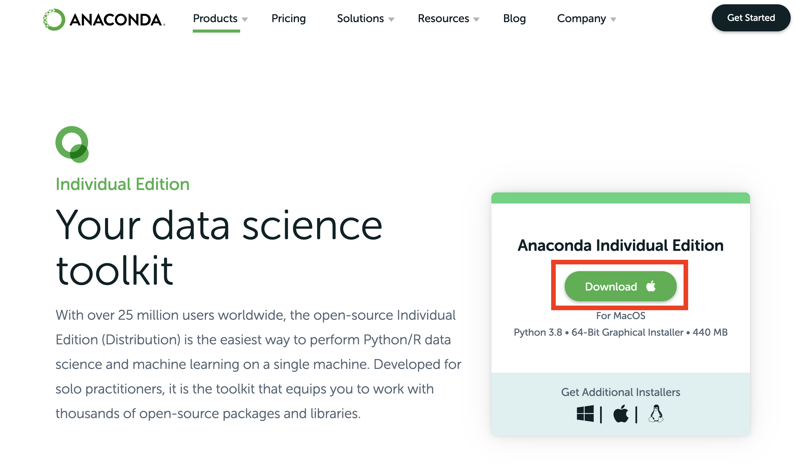
```

---

```{r, fig.align='center', out.width=600}
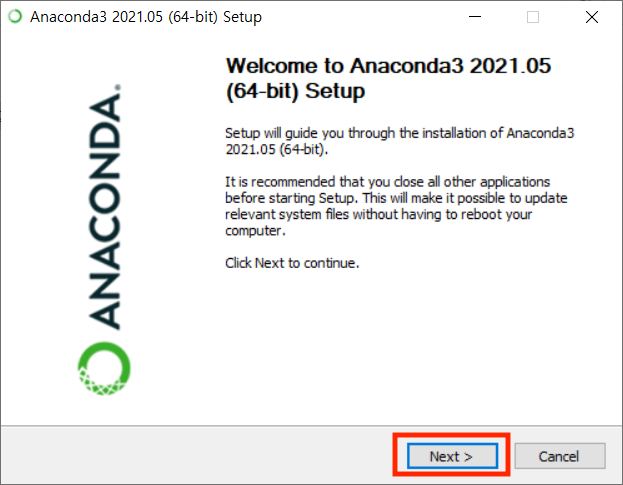
```

---

```{r, fig.align='center', out.width=600}
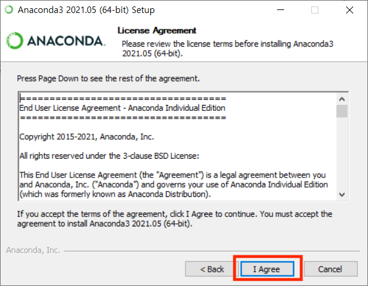
```

---

```{r, fig.align='center', out.width=600}
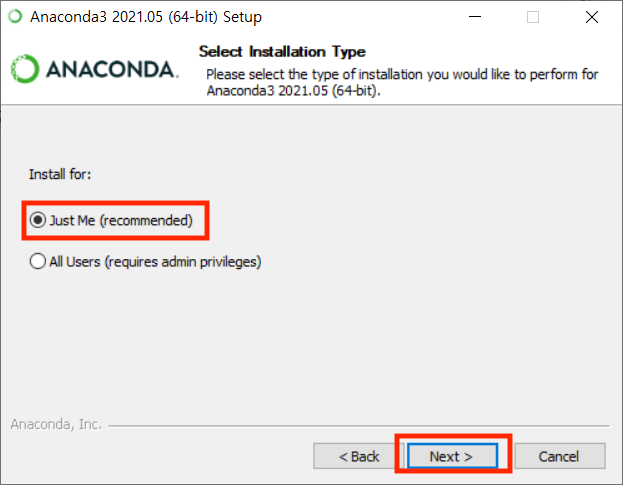
```

---

```{r, fig.align='center', out.width=600}
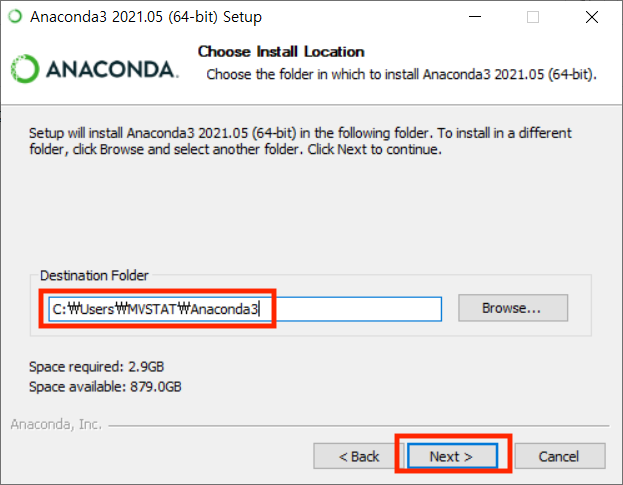
```

---

```{r, fig.align='center', out.width=600}
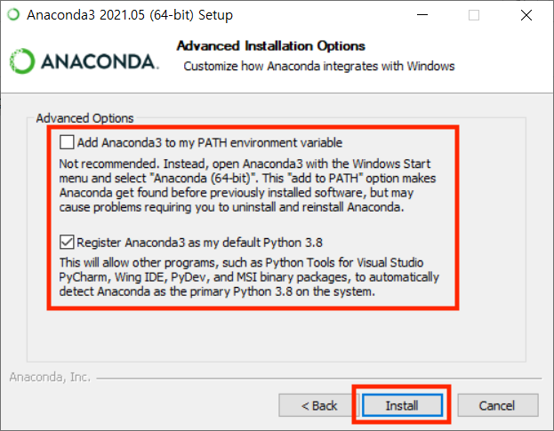
```

---

```{r, fig.align='center', out.width=600}
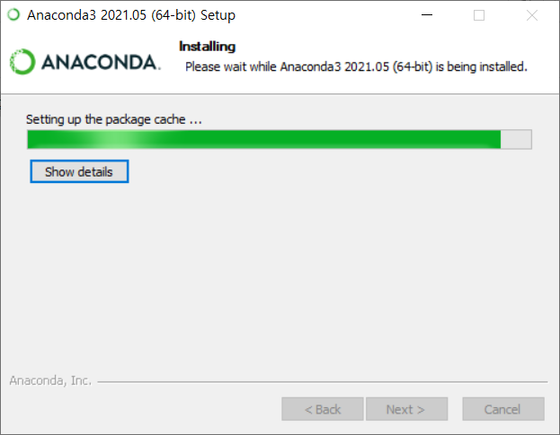
```

---

```{r, fig.align='center', out.width=600}
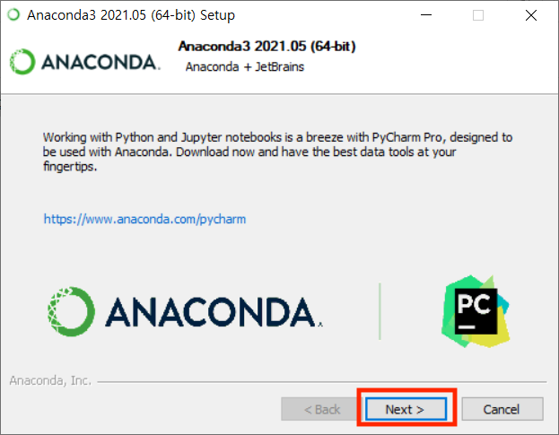
```

---

```{r, fig.align='center', out.width=600}
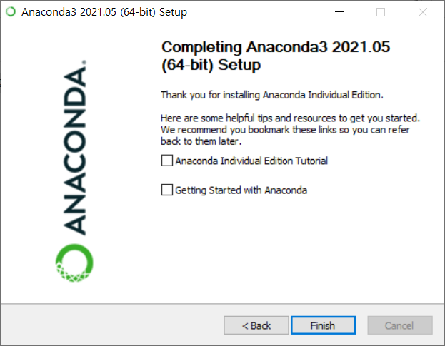
```

---
layout: true

# Anaconda 설치 확인

---

- 시작메뉴에서 **Anaconda Prompt** 실행

```{r, fig.align='center', out.width=500, fig.cap="<그림출처: https://wonderbout.tistory.com/22>"}
knitr::include_graphics("https://img1.daumcdn.net/thumb/R1280x0/?scode=mtistory2&fname=http%3A%2F%2Fcfile28.uf.tistory.com%2Fimage%2F99D5EA4F5BE150ED1458FA")
```

---

- **Anaconda Prompt**에서 다음을 한 줄씩 실행

- 한 줄씩 실행할 때 마다 오류 발생하지 않는지 확인!

```bash
python --version
python
print("Hello world")
```

```{r, fig.align='center', out.width=1000}
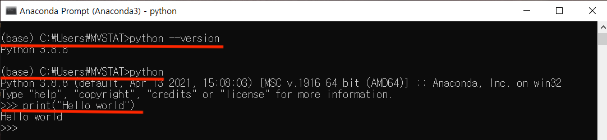
```

---
layout: false
class: inverse, middle, center

# Jupyter Lab
```{r, fig.align='center', out.width=200}
knitr::include_graphics("https://upload.wikimedia.org/wikipedia/commons/3/38/Jupyter_logo.svg")
```


<!-- --- -->

<!-- # Anaconda Navigator -->

<!-- - 시작메뉴에서 **Anaconda Navigator** 실행 -->

<!-- - Anaconda의 패키지와 여러 개발환경을 실행 및 다룰 수 있는 편리한 툴 -->

<!-- ```{r, fig.align='center', out.width=600} -->
<!-- 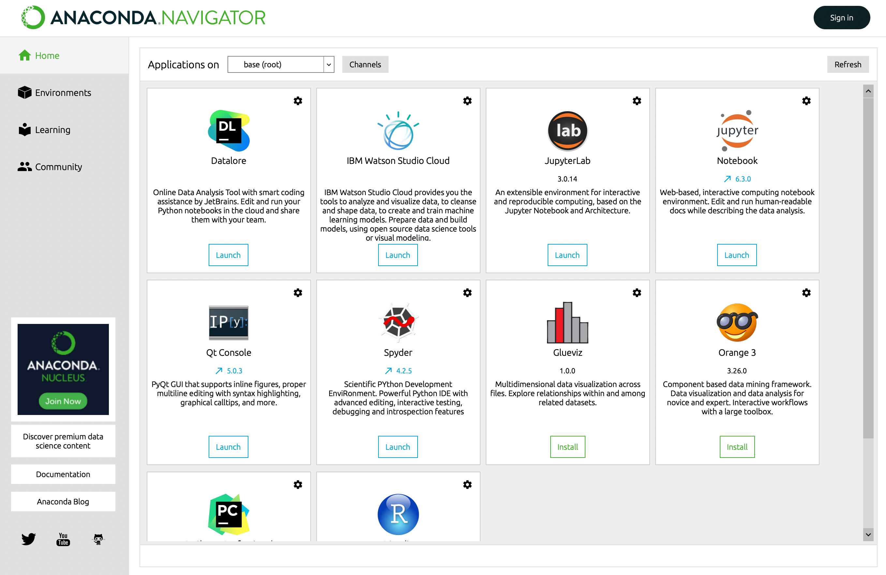 -->
<!-- ``` -->

---

# Jupyter Lab

- **앞으로 실습에서 사용할 파이썬 개발 환경**

- **파이썬을 활용한 데이터 분석에서 널리 사용되고 있음**

- **코드블럭마다 실행결과를 확인할 수 있어 리포트처럼 보기에 좋음**

```{r, fig.align='center', out.width=200}
knitr::include_graphics("https://upload.wikimedia.org/wikipedia/commons/3/38/Jupyter_logo.svg")
```

---

# Jupyter Lab 실행 방법

- 시작메뉴에서 **Anaconda Navigator** 실행

- **Jupyter Lab** 박스 밑에 **Launch** 클릭

```{r, fig.align='center', out.width=600}
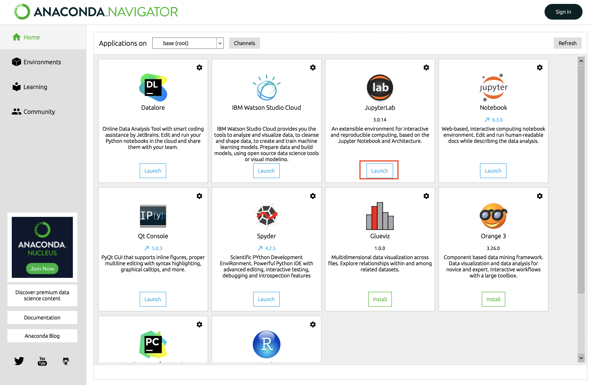
```

---

# Jupyter Lab 실행 화면

- 웹창이 열리게 되고 다음과 같은 화면이 나타남

- **Notebook**의 **Python3** 클릭

```{r, fig.align='center', out.width=600}
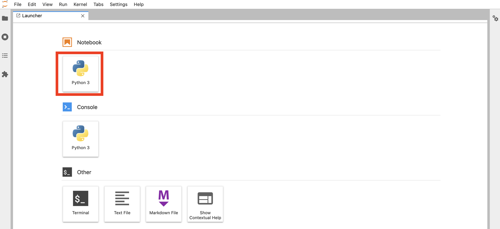
```

---

# Jupyter notebook

- 다음과 같은 jupyter notebook 파일이 열리게 됨

- 아래 그림과 같이 한 줄씩 입력하여 실행되는지 확인
  - 실행은 shift+enter 또는 ctrl+enter

- 코드블럭 추가는 위에 **+** 기호를 누르면 됨

```{r, fig.align='center', out.width=1000}
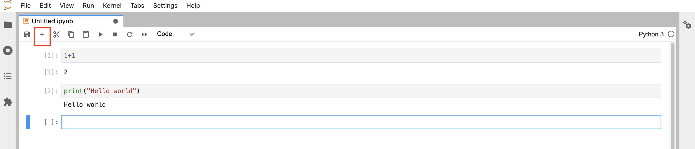
```

---

# Reference

- [점프 투 파이썬](https://wikidocs.net/book/1)

- https://wonderbout.tistory.com/22

- https://popooly.tistory.com/26

- https://bradbury.tistory.com/60


---
layout: true

# 실습 환경설정

- **크롬** 설치 (나중에 크롤링할 때 필요)

- 각자 컴퓨터의 홈 디렉토리(*C:/Users/유저명/*)에 **python_study** 폴더 만들기

---

```{r, fig.align='center', out.width=600}
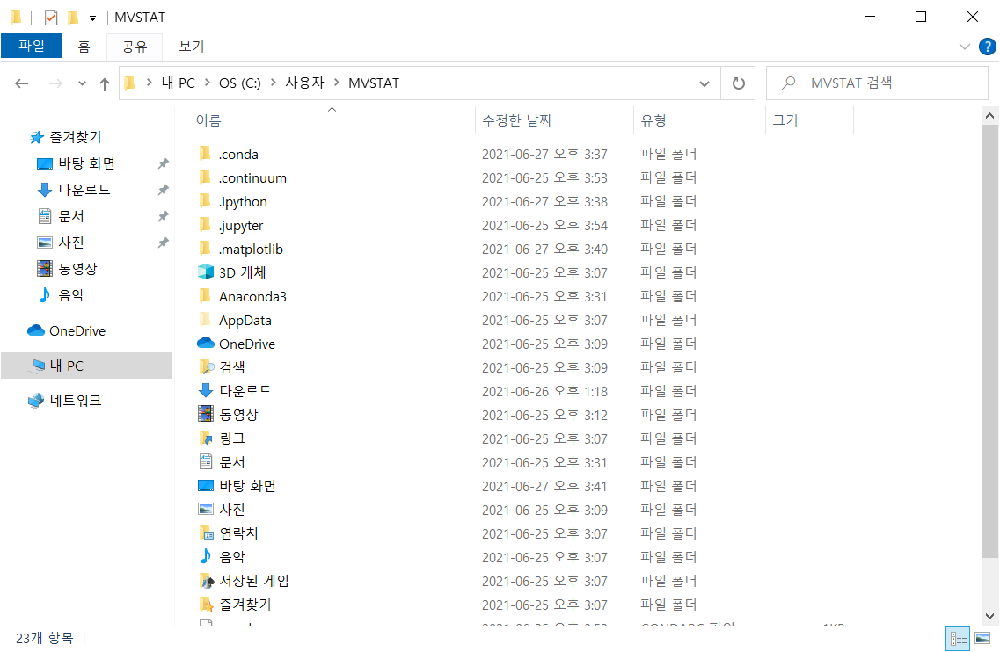
```

---

```{r, fig.align='center', out.width=600}
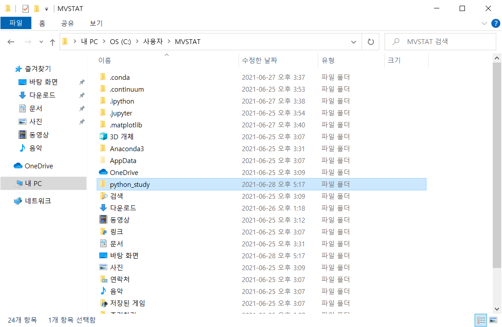
```

---

```{r, fig.align='center', out.width=600}
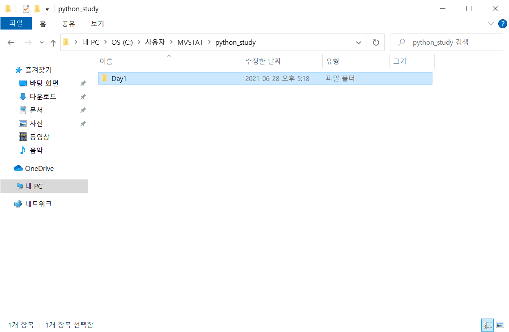
```

---
layout: false
class: center, middle

# 감사합니다!

#### 수업관련 질문사항은 아래 메일로 보내주세요.

hyunsung1021@gmail.com

#### 실습자료는 아래 페이지에서 받으실 수 있습니다.

https://statkim.github.io/stats-summer-2021/
