```{r setup, include = FALSE}
library(knitr)
library(tidyverse)
library(xaringanExtra)
xaringanExtra::use_panelset()
# set default options
opts_chunk$set(dpi = 300,
               echo = FALSE)
```

class: title-slide, left, bottom

# `r rmarkdown::metadata$title`
----
## **`r rmarkdown::metadata$subtitle`**
### `r rmarkdown::metadata$author`
### `r rmarkdown::metadata$institute`
### `r rmarkdown::metadata$date`

---
class: inverse, middle, center

# 가상환경이란?

---

# 가상환경이란?

- **가상환경(Virtual Environments)는 가상의 파이썬 환경울 구축하는 것을 의미**

- **파이썬 설치 이후 우리가 사용하고 있는 것은 `base`이며, 여기에 계속 라이브러리를 설치하다보면 라이브러리 간의 의존성(dependency) 문제가 종종 발생**

- **이러한 문제를 해결하기 위해 독립적인 파이선 환경을 만들어 패키지와 버전을 관리하기 위한 것이 가상환경!!**

---
layout: true

# 가상환경이 왜 필요할까?

---

```{r, fig.align='center', out.width=500, fig.cap = "그림출처: https://dojang.io/mod/page/view.php?id=2470"}
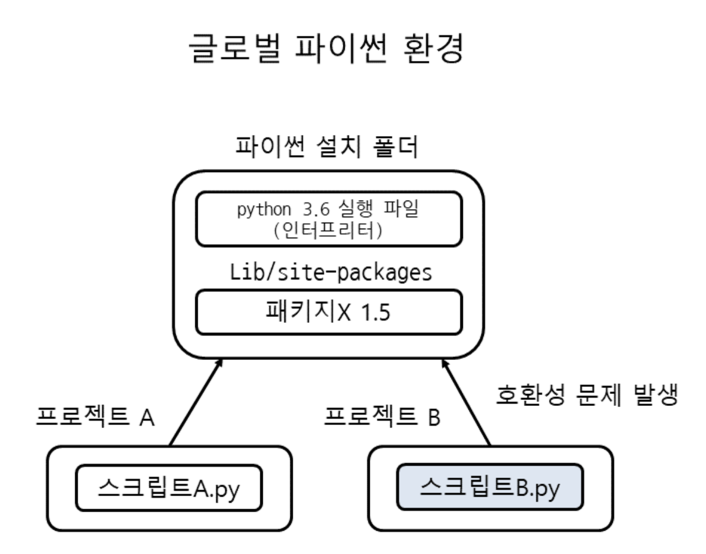
```

---

```{r, fig.align='center', out.width=600, fig.cap = "그림출처: https://dojang.io/mod/page/view.php?id=2470"}
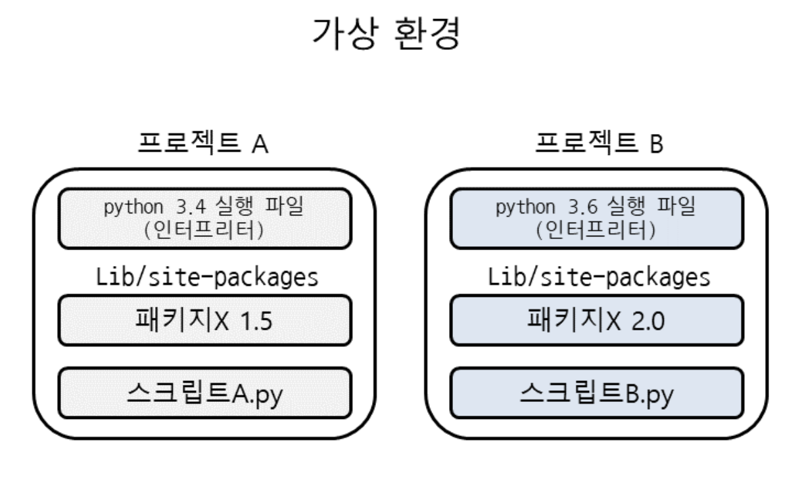
```

---
layout: false
class: inverse, middle, center

# 가상환경 만들기

---

layout: true

# 가상환경 만들기

---

```{r, fig.align='center', out.width=700}
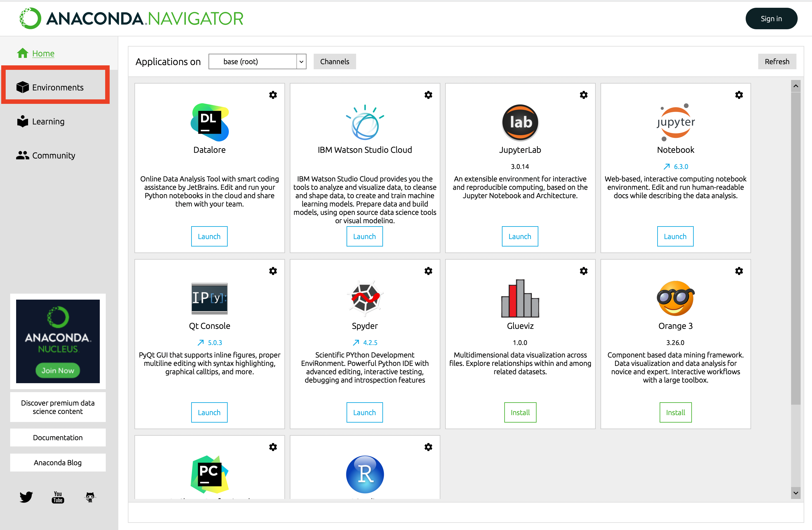
```

---

```{r, fig.align='center', out.width=700}
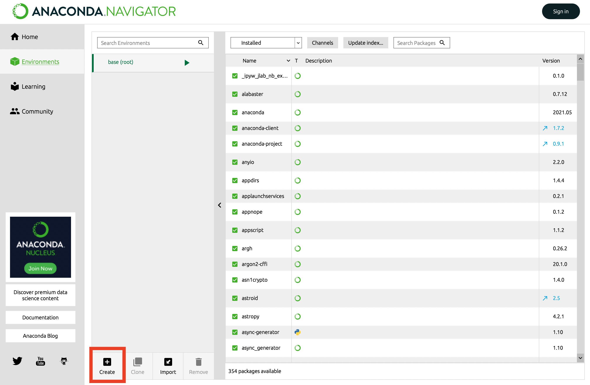
```

---

```{r, fig.align='center', out.width=700}
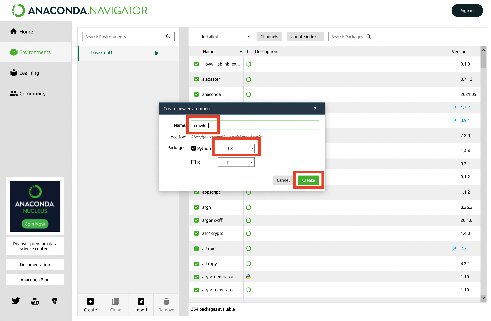
```

---

```{r, fig.align='center', out.width=700}
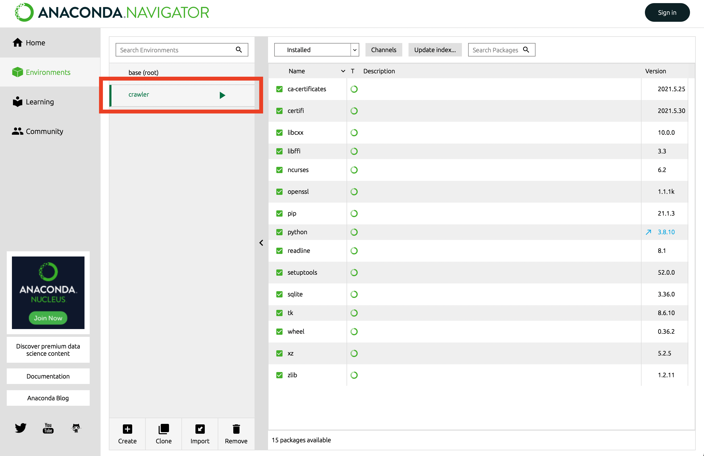
```

---

```{r, fig.align='center', out.width=700}
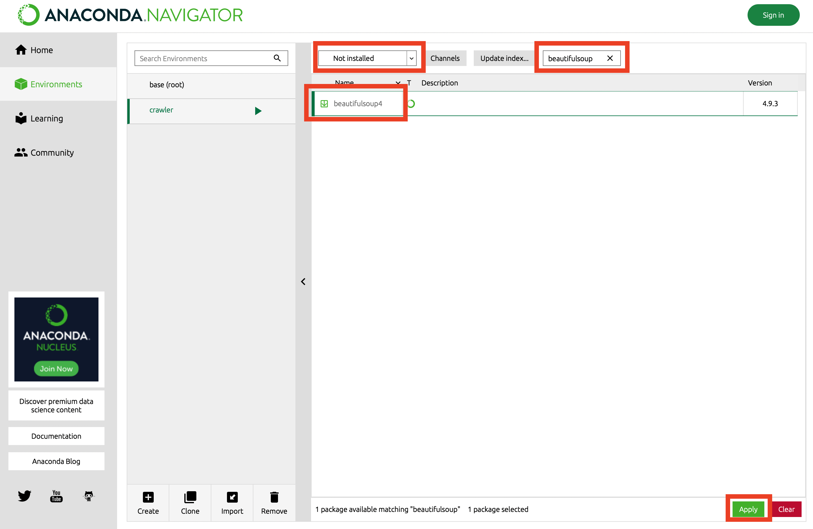
```

---

```{r, fig.align='center', out.width=700}
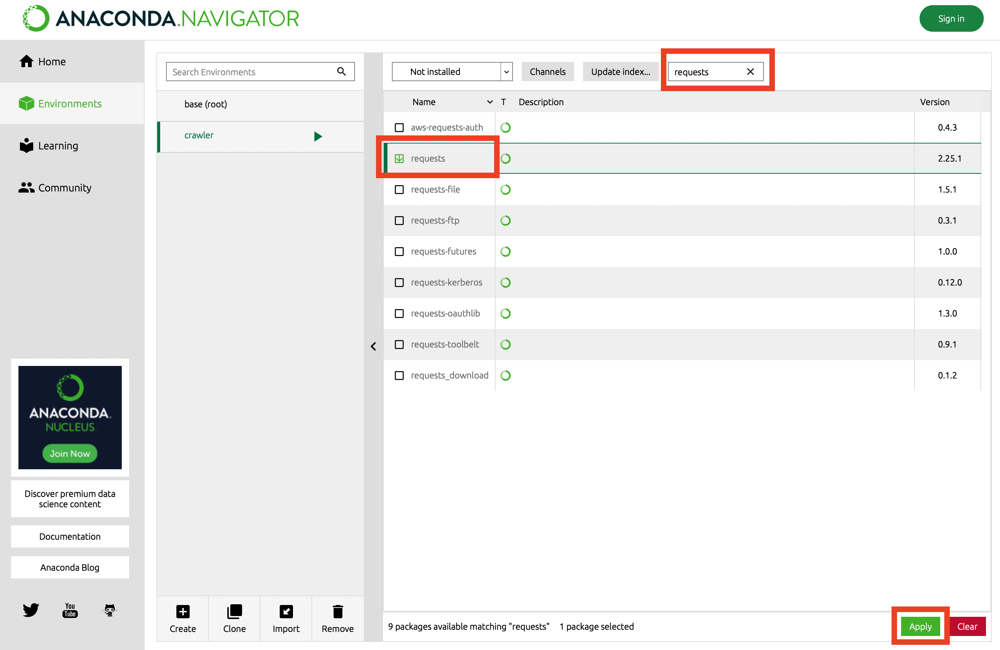
```

---

```{r, fig.align='center', out.width=700}
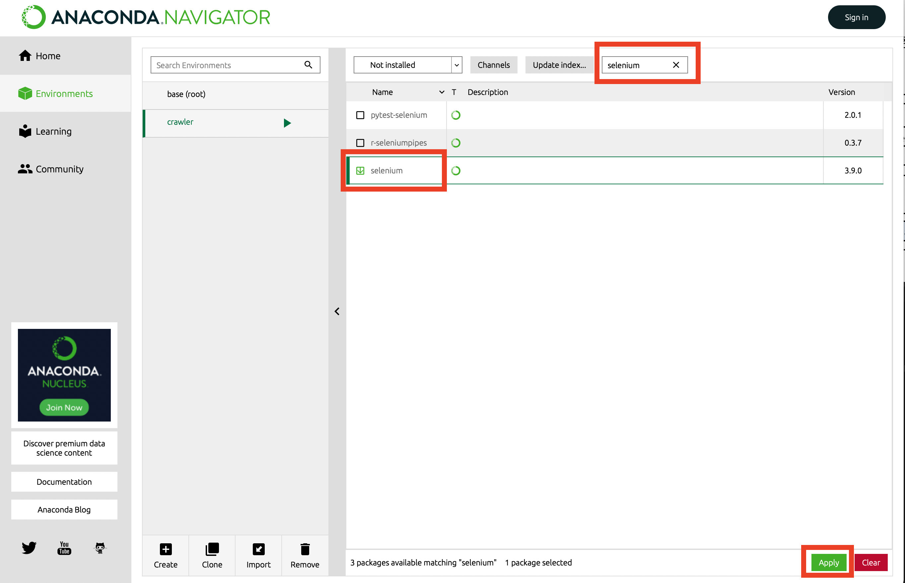
```

---

```{r, fig.align='center', out.width=700}
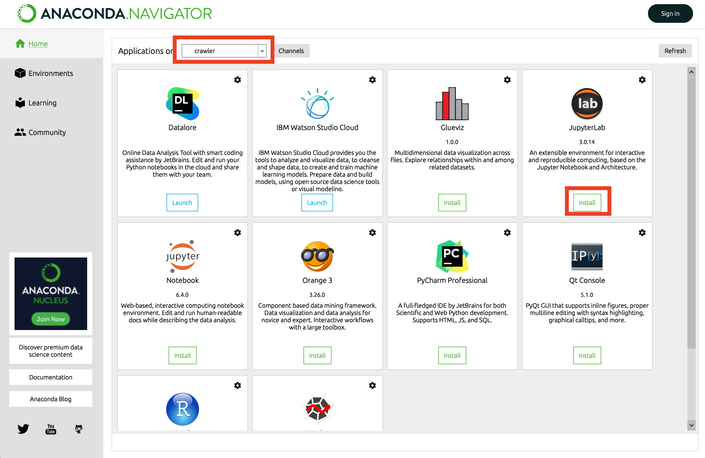
```

---

```{r, fig.align='center', out.width=700}
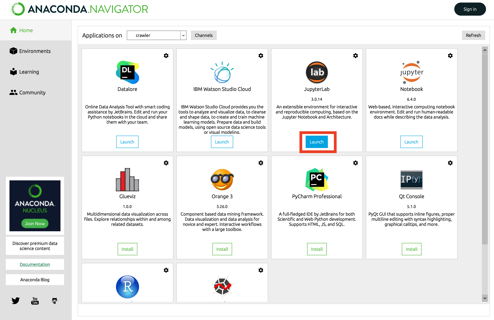
```

---
layout: false
class: center, middle

# 감사합니다!

#### 수업관련 질문사항은 아래 메일로 보내주세요.

hyunsung1021@gmail.com

#### 실습자료는 아래 페이지에서 받으실 수 있습니다.

https://statkim.github.io/stats-summer-2021/

